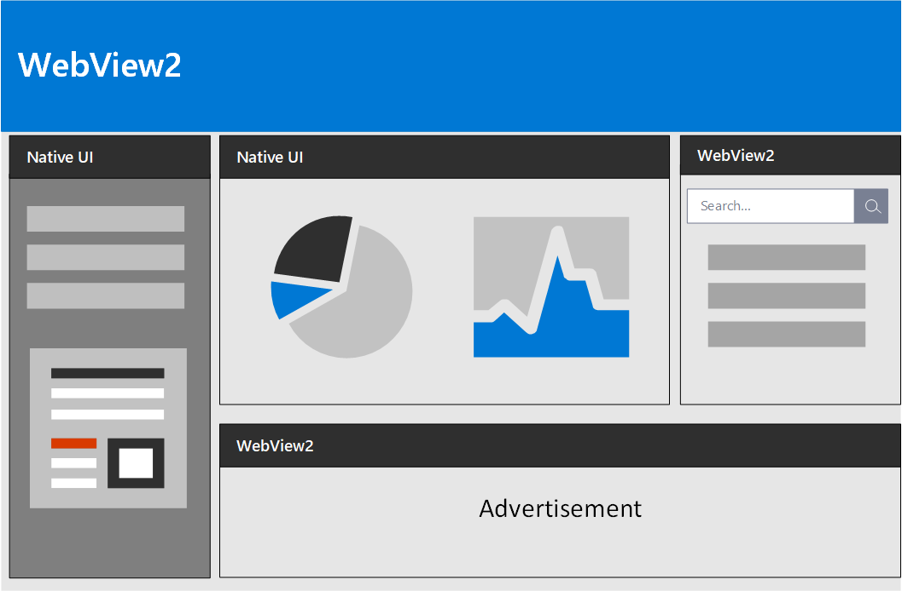
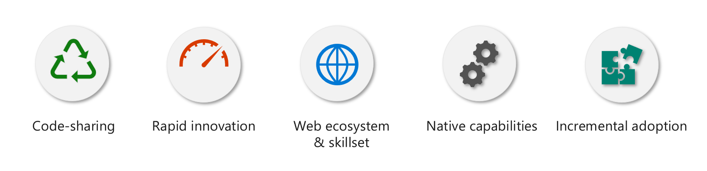

# Introduction to Microsoft Edge WebView2 (Preview)

The Microsoft Edge WebView2 control enables you to host web content in your native application using [Microsoft Edge (Chromium)](https://www.microsoftedgeinsider.com/) as the rendering engine.

With WebView2, developers can embed web code (HTML/CSS/Javscript) in parts of their native application or build the entire native application with a single WebView.

[!NOTE]
The WebView2 control is currently in developer preview, during which you can prototype your solutions and share feedback with us to shape the future stable API. There will likely be some breaking changes as we evolve the API during preview, and when this happens, you will need to have both the WebView2 SDK and the Microsoft Edge (Chromium) browser updated. Breaking changes will be noted in the [release notes](webview2/releasenotes.md) of the SDK. This will lock down as WebView2 approaches beta and stable.

## Web vs. Native Development

When building an application, developers often have to chose between building a web application or a native application. The decision often hinges on the trade-off between Reach and Power.

Web applications allow for a broad reach. Web developers can reuse most, if not all of their code across all different platforms. Native applications are more powerful. Native developers utilize the capabilities of the entire native platform.

Hybrid applications allow developers to have the best of both worlds. Hybrid application developers benefit from the ubiquity and strength of the web platform as well as the power and full capabilities of the native platform.

## Benefits of Hybrid Applications

WebView2 is an essential component of hybrid applications, because it allows for: 

1. **Code Sharing:** Using web code allows developers to share their codebase across platforms.
2. **Rapid Innovation:** Web development allows for faster deployment and iteration.
3. **Web Ecosystm & Skillset:** Developers can utilize the entire web platform, tooling, and talent that exists within the web ecosystem.
4. **Native Capabilities:** Developers can access the full set of Native APIs.
5. **Incremental Adoption:** Developers can add web components piece by piece into their application.

## Supported Platforms

A developer preview is available for Win32 C++, .NET Framework, and .NET Core on Windows 10, Windows 8.1, Windows 8, Windows 7, Windows Server 2016, Windows Server 2012/2012R2, and Windows Server 2008 R2. An Alpha version for WinUI 3.0 is available [here](https://docs.microsoft.com/uwp/toolkits/winui3/).   

## Getting Started

To build and test your application using the WebView2 control, you need to have both [Microsoft Edge (Chromium)](https://www.microsoftedgeinsider.com/download/) and the [WebView2 SDK](https://aka.ms/webviewnuget) installed. See [Getting Started](webview2/gettingstarted.md) for detailed instructions, [WebView2 API Sample](https://github.com/MicrosoftEdge/WebView2Samples/tree/master/WebView2APISample) for an interactive guide, [API reference](webview2/reference-webview2.md) to learn about the API, and [Release Notes](webview2/releasenotes.md) for changes made between releases.

## WebView2 Samples

The [WebView2 Samples](https://github.com/MicrosoftEdge/WebView2Samples) repository contains samples that demonstrate all of the WebView2 SDK's features and their API use patterns. As we add more features to the WebView2 SDK, we will regularly update our sample applications.

## Feedback

Help us build a richer WebView2 experience by sharing your feedback! Visit our [feedback repo](https://aka.ms/webviewfeedback) to submit feature requests or bug reports. It’s also a good place to search for known issues.
During developer preview, we will also be collecting telemetry data to help us build a better WebView. Users can turn off WebView data collection by navigating to edge://settings/privacy in the browser and turning off browser data collection.
