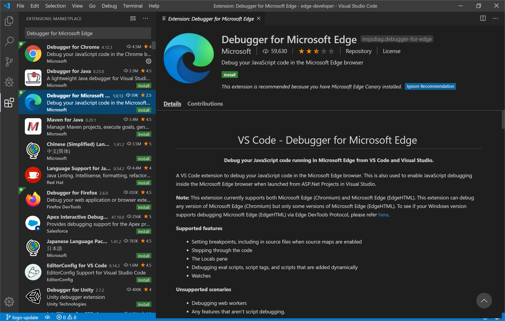
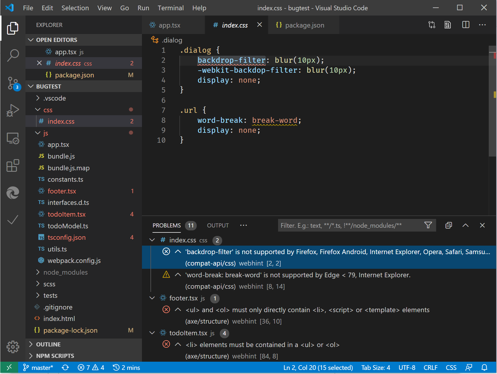

# Visual Studio Code

[Visual Studio Code](https://code.visualstudio.com/Docs) is a lightweight but powerful source code editor which runs on your desktop and is available for Windows, macOS and Linux. It comes with built-in support for JavaScript, TypeScript and Node.js so it's a great tool for web developers right out of the box! Head to [this page](https://code.visualstudio.com/) to download Visual Studio Code if you aren't using it yet.

## Extensions

<!-- We want to put something like the tiles for extensions VS Code uses on this page https://code.visualstudio.com/Docs#top-extensions but I don't think this is a markdown page. I think it's a web page. I couldn't find anything in https://github.com/Microsoft/vscode-docs that looks like this page. In the meantime, here's what I've come up with: -->

To acquire any of the extensions highlighted below, navigate to Extensions (`Ctrl` + `Shift` + `X` on Windows or `Command` + `Shift` + `X` on Mac) in VS Code.

Search the Marketplace for the specific extension and select **Install**.

## Debugger for Microsoft Edge

Debug your front-end JavaScript code line by line and display `console.log()` statements directly in [Visual Studio Code](https://code.visualstudio.com/) using the the [Debugger for Microsoft Edge](https://marketplace.visualstudio.com/items?itemName=msjsdiag.debugger-for-edge) VS Code extension!

Use the [Debugger for Microsoft Edge](https://marketplace.visualstudio.com/items?itemName=msjsdiag.debugger-for-edge) VS Code extension to launch or attach to both Microsoft Edge (EdgeHTML) and Microsoft Edge (Chromium). Check out [this page](./debugger-for-edge.md) for a walkthrough of debugging Microsoft Edge from VS Code and sample **launch.json** configurations.

<!--  -->  

--- 

> markdown-only test

---  

  

---  

> plugin using lightbox target

---

:::image type="content" source="./media/vscode-debugger-install.png" alt-text="Debugger for Edge VS Code extension in action" lightbox="./media/debugger-for-edge.gif#lightbox":::

---  

> plugin only

---  

:::image type="content" source="./media/vscode-debugger-install.png" alt-text="Debugger for Edge VS Code extension in action" lightbox="./media/debugger-for-edge.gif":::

---  

> foootnote

---  

| Change | Expected in Official Build | Experimentation | Additional information |  
|:--- |:--- |:--- |:--- |
| Cookies default to `SameSite=Lax` | Chrome or Chrome plus 1[^Chrome=+1]  | Canary v82, Dev v82 | This change is happening in the Chromium project, on which Microsoft Edge is based.  For more information, including the planned timeline by Google for this change, please review the [Chrome Platform Status entry][ChromePlatformStatus5088147346030592].  |  
| Referrer Policy: Default to `strict-origin-when-cross-origin` | Chrome or Chrome plus 1[^Chrome=+1]  | Canary v79, Dev v79 | This change is happening in the Chromium project, on which Microsoft Edge is based.  For more information, including the planned timeline by Google for this change, please review the [Chrome Platform Status entry][ChromePlatformStatus6251880185331712].  |  
| Disallow synchronous XmlHttpRequest in page dismissal | Chrome plus 1[^Chrome+1] (Edge v83) |  | This change is happening in the Chromium project, on which Microsoft Edge is based.  Matching Chrome, Microsoft Edge offers a Group Policy to disable this change until Edge 88.  For more information, including the planned timeline by Google for this change, please review the [Chrome Platform Status entry][ChromePlatformStatus4664843055398912].  |  
| Display subtle prompt for notification permissions requests |  | Canary v83, Dev v83 | Users may now opt into Quiet Notification Requests in `edge://settings/content/notifications`.  With this setting enabled, Microsoft Edge displays a subtle request icon in the address bar for sites which request to send users future notifications using the `Notifications` or `Push` API.  This subtle icon replaces the flyout permission prompt.  An experiment in Canary and Dev turns this behavior on by default for some users, on all sites that request notifications permissions.  Users may opt out in `edge://settings/content/notifications`.  In the future, the Microsoft edge team may explore displaying the flyout prompt in specific situations based on user behaviors and other input.  |  
| Disable TLS/1.0 and TLS/1.1 by default | Edge v84 |  | To help discover impacted sites, you may set the `edge://flags/#display-legacy-tls-warnings` flag to cause Microsoft Edge to display a non-blocking "Not Secure" notice when loading pages that require legacy TLS protocols.  The [SSLMinVersion][DeployedEdgePoliciesSSLMinVersion] Group Policy permits re-enabling of TLS/1.0 and TLS/1.1; the policy remains available until Edge 88.  |  
| Block mixed content downloads | Chrome plus 1[^Chrome+1]  \(Edge v85\)  |  | This change is happening in the Chromium project, on which Microsoft Edge is based.  For more information, including the planned timeline by Google for this change, please review the [Google security blog entry][GoogleBlogSecurity20200206].  The Microsoft rollout schedule on file types to warn or block is planned for one release after Chrome.  |  

---  

[^Chrome+1]:  
Based on user and developer feedback, the indicated feature or change ships one release after Chrome.  
[^Chrome=+1]:  
Based on user and developer feedback, the indicated feature or change ships at the same time or one release after Chrome.  

---  

---  

## Elements for Microsoft Edge

By adding the [Elements for Microsoft Edge](https://marketplace.visualstudio.com/items?itemName=ms-edgedevtools.vscode-edge-devtools) VS Code extension, you can use the browser's Elements tool from within Visual Studio Code. By either launching or attaching, the Elements tool will connect to an instance of Microsoft Edge, display the runtime HTML structure, and allow you to alter the layout or fix styling issues.

For more information, check out [this page](./elements-for-edge.md).

## webhint

Use [webhint](https://webhint.io), a customizable linting tool, to improve the accessibility, performance, cross-browser compatibility, PWA compatibility, and security of your site. It checks your code for best practices and common errors. This open-source project, initially developed by the Microsoft Edge team, is now part of the [OpenJS Foundation](https://openjsf.org/). The Microsoft Edge team continues to contribute to webhint alongside web developers in the community.

Identify and fix problems in your HTML, CSS, JavaScript, TypeScript, and more by adding the [webhint extension for VS Code](https://marketplace.visualstudio.com/items?itemName=webhint.vscode-webhint). Hints appear as inline underlines and are summarized in the Problems pane.

For more information, see [How to use webhint in Visual Studio Code](./webhint.md).
